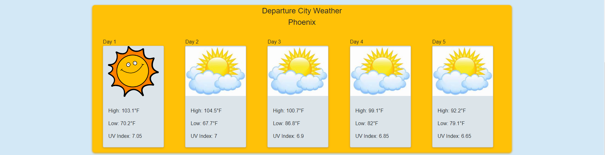
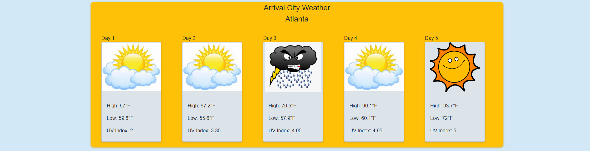

The Great Mashup

This application was created to assist with air travel.
The Great Mashup application can be used when planning your trip.
You'll be able to put in your departure and arrival cities and get
the weather forcast in both locations. This quick one stop app helps
you to determine how your flight is going to go in regard to weather.

As travelers we love flying. It's the fastest form of travel and all you
have to do is buckle up. But there are so many things to do before you get
to your seat. We all get so busy planning the trip and getting to the airport
on time that we forget about "small" but "big" things like the weather.
And if you're caught off guard you could be sleeping in airport.

We learned alot developing this project. We used the tools we learned these last four weeks.
this project allowed us to really work through codes and work together.
We originally chose an application that assists with Stock and World news that would affect stock options. However, we found it
difficult to find a free api without restrictions. We pivioted our idea to an aviation application that could assist travelers with their flights and
any related weather on their journey that could affect their flight experience. We found

https://airlabs.co/
https://open-meteo.com/

We faced some challenges with merging on two branches on Github and lost some codes that didnt come over when he did a pull request in html.

We faced some challenges with fetching data from multiple airports at once. The code seemed to give him data for a particular airport at a time
but not several. We chose to search by flight number instead of searching by airport. We still had some troubleshooting to do to initiate a "Search
by flight number".

In working with the Opensky aviation api "https://openskynetwork.github.io/opensky-api/index.html" we thought we ran into the cors issue but with some aid, realized the coding with slightly off giving us that
result. We went ahead using it until realizing at the end it wasnt going to be sufficient.

We faced some challenges with fetching the Openmeteo weather API. Something in my code kept giving me error messages on the console log.
I am not sure what the initail issue was but with some aid was able to get the api successfully fetching information.
We faced several personal challenges as well with out VS code and other applications. But working through these issues really helped us
gain understanding of what we were doing. This project really helped us strengthen our skills.

We were able to create this application using many technologies
from class including...

Google
OpenSky
Open Meteo
Unix timestamp
Vanilla CSS
Flexbox

User Story: To have access to an application that can assist with air travel. To be able to check my flight and the weather at my departure and arrival
destinations to help determine if my flight will be on time.

Acceptance Criteria:
When I go to the Url link
then I'm able to put in my flight information into a responsive form
when I put in my flight number, departure and arrival cities
then I recieve back data confirming my flight and the area weather at my
departure and arrival destionation for up to 5 days at a time.
When I view the site
then I find an interactive, responsive application. Using 2 server side API's
and client side storage.

Installation
No installation required. Access the application via
https://breakfastsandwich.github.io/the_great_mashup/
You'll find a form to include your flight number.
Your flight information will appear as well as the weather forcast
for your departing and arriving cities.
You'll be about to see multiply days and previous searchs.

Collaborators
This was a group project for group five
William Speakman
Zachary McDowell
Shayla Morris

Repository url:
https://github.com/BreakfastSandwich/the_great_mashup

deployed page:
https://breakfastsandwich.github.io/the_great_mashup/

